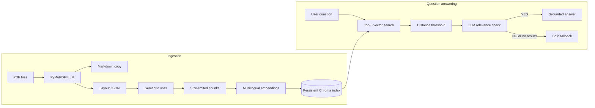

# Document RAG Assistant

A command-line RAG system for answering questions from private PDFs. It parses
documents, creates layout-aware chunks, stores multilingual embeddings in
Chroma, retrieves relevant passages, and uses LangGraph to generate a grounded
answer or a safe fallback.

Source PDFs, parsed content, embeddings, the local database, and credentials are
excluded from Git.

## Architecture



### PDF conversion and chunking

`python -m src.main ingest` reads `*.pdf` files directly from `data/pdfs/`.
PyMuPDF4LLM writes two files per document to `data/parsed/`:

- `<document>.md` for readable extracted text.
- `<document>.json` for layout data used by the chunker.

The chunker processes text boxes in page order and preserves document
structure:

- A top-level section starts with a numbered heading such as `1. Introduction`
  at `x0 <= 70`.
- A subsection is a bullet heading, an indented `section-header`, or short,
  indented text with at least 50% bold spans.
- A subsection repeats its parent heading to retain context.
- Metadata records the source, page range, section, subsection, unit index, and
  chunk index.
- Oversized semantic units use `RecursiveCharacterTextSplitter` with a
  1,200-character size, 150-character overlap, and separators in this order:
  blank line, newline, sentence boundary, space, and character.

The current parser does not scan subdirectories or configure a separate OCR
stage. Image-only PDFs may require OCR before ingestion.

### Embeddings and retrieval

Chunks are embedded on the CPU with normalized
`sentence-transformers/paraphrase-multilingual-MiniLM-L12-v2` embeddings and
stored in `data/chroma/` under the `document_knowledge_base` collection.

For each question, Chroma returns the three nearest chunks. Results with a
distance score above `0.85` are discarded. Lower scores are more relevant.
Chroma uses its default distance metric because the code does not set
collection-level metric metadata. The Python retrieval API also supports an
exact `source` filter, which is not exposed by the CLI.

If the collection already contains records, ingestion skips insertion. Delete
the generated `data/chroma/` directory and ingest again after changing PDFs,
the embedding model, or collection settings.

### LangGraph workflow

The graph state contains `question`, `results`, `context`, `has_context`,
`answer`, and `error`. The workflow is:

1. `retrieve` searches Chroma and formats each result with its content and
   source metadata.
2. `check_context` rejects empty context or asks the LLM to return `YES` or `NO`
   based on whether the retrieved text can support an answer.
3. `route_context` sends relevant context to `answer`; otherwise it selects
   `fallback`.
4. `answer` responds only from the context, without guessing, and uses the same
   language as the question.
5. `fallback` returns an English message for insufficient evidence or an LLM
   service failure.

The compiled graph is cached, but conversation state is not persisted. Each
`ask` command is independent. A successful answer normally makes two LLM calls:
one relevance check and one answer-generation request.

## Project structure

```text
src/
  ingestion/    PDF parsing and chunking
  retrieval/    Embeddings, Chroma, and search
  generation/   LLM setup, context, and answer prompt
  workflow/     LangGraph nodes and routing
  main.py       CLI entry point
  settings.py   Configuration loader
tests/           Unit tests
config.yaml      Paths and retrieval settings
.env.example     LLM configuration template
data/            Local input and generated data
```

## Setup

Python 3.10 or newer is required; Python 3.12 is recommended.

### Windows PowerShell

```powershell
python -m venv .venv
.\.venv\Scripts\Activate.ps1
python -m pip install --upgrade pip
pip install -r requirements.txt
Copy-Item .env.example .env
```

### macOS or Linux

```bash
python3 -m venv .venv
source .venv/bin/activate
python -m pip install --upgrade pip
pip install -r requirements.txt
cp .env.example .env
```

Configure `.env`:

```dotenv
OPENROUTER_API_KEY=your-api-key
OPENAI_BASE_URL=https://openrouter.ai/api/v1
MODEL_NAME=openai/gpt-5-mini
```

The project uses `ChatOpenAI` with an OpenAI-compatible endpoint. The example
uses OpenRouter, but the base URL and model can be changed. `HF_TOKEN` is
optional. The embedding model is downloaded on first use.

Paths and retrieval settings are in `config.yaml`:

```yaml
paths:
  pdf_dir: data/pdfs
  parsed_dir: data/parsed
  chroma_dir: data/chroma

retrieval:
  collection_name: document_knowledge_base
  embedding_model: sentence-transformers/paraphrase-multilingual-MiniLM-L12-v2
  max_distance: 0.85
```

## Usage

Add PDFs and build the knowledge base:

```powershell
New-Item -ItemType Directory -Force data/pdfs
Copy-Item C:\path\to\documents\*.pdf data/pdfs/
python -m src.main ingest
```

Ask a question:

```powershell
python -m src.main ask "Question"
python -m src.main ask "Question" --quiet
```

The CLI prints the answer and accepted sources with document, page range,
section, subsection, and distance score. `--quiet` hides workflow progress only.

The components can also be called from Python:

```python
from src.ingestion.ingest import parse_pdfs
from src.retrieval.vectorstore import build_vectorstore
from src.retrieval.retrieval import retrieve
from src.main import ask

parse_pdfs()
build_vectorstore()
results = retrieve("query", k=3, source="policy-handbook")
state = ask("Question", show_progress=False)
```

The `source` value is the PDF filename without `.pdf`.

## Tests

```powershell
python -m pytest
```

Tests cover chunk detection and metadata, retrieval thresholds and filters,
LangGraph routing, context construction, CLI progress, and expected errors.

## Future improvements

The project intentionally remains a basic, single-turn RAG workflow. Possible
future improvements, in suggested implementation order, are:

1. Add a `search` command that displays retrieved chunks, metadata, and distance
   scores without calling the LLM.
2. Expose `top-k`, `max-distance`, and `source` filters as CLI options.
3. Add `ingest --rebuild` so the local Chroma index can be recreated without
   manually removing `data/chroma/`.
4. Generate deterministic chunk IDs from the source, unit index, and chunk
   index to prevent duplicate records.
5. Require inline source and page citations in generated answers.
6. Add a small JSONL evaluation runner for retrieval hits, expected answer
   keywords, and correct fallback behavior.
7. Include out-of-scope evaluation questions to measure hallucination
   prevention and conditional routing.
8. Print ingestion statistics such as PDFs parsed, semantic units created,
   chunks generated, and records indexed.
9. Add a `status` command that reports the collection name, indexed chunk
   count, embedding model, and available PDFs.
10. Add Docker support after the core CLI and evaluation workflow are stable.

These additions should preserve the current architecture:

```text
Retrieve -> Check context -> Answer or Fallback
```

Conversation memory, agent loops, query rewriting, hybrid search, and reranking
are deliberately outside the initial scope.

## Privacy and limitations

- Everything under `data/`, except `data/README.md`, is ignored by Git. Secrets,
  databases, archives, and logs are also ignored.
- Retrieved document text is sent to the configured LLM provider for relevance
  checking and answer generation. Review the provider's data-handling terms.
- This starter does not include production authentication, authorization,
  encryption, retention controls, observability, evaluation, or automatic
  index updates.

Common failures can usually be resolved by adding PDFs to `data/pdfs/`, running
ingestion, rebuilding `data/chroma/` if it is stale, or completing all required
values in `.env`.
